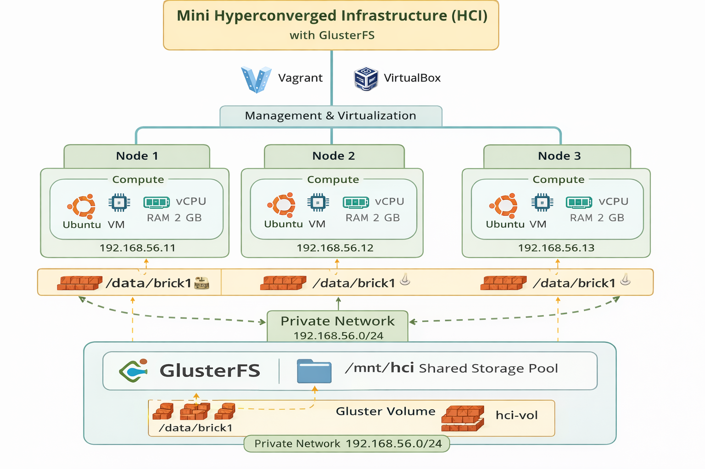
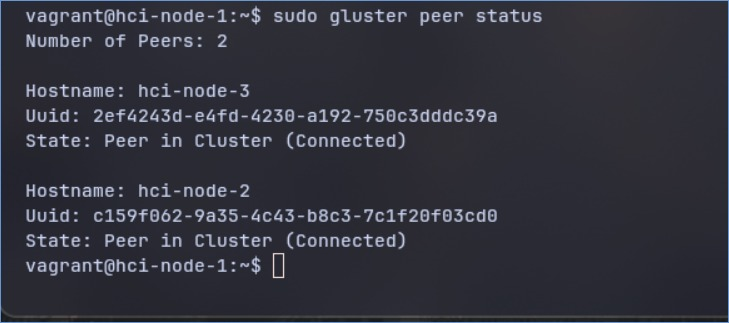
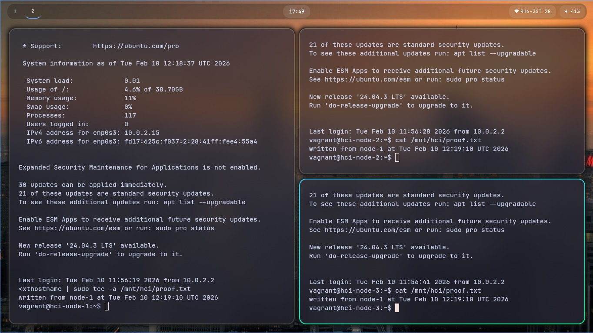
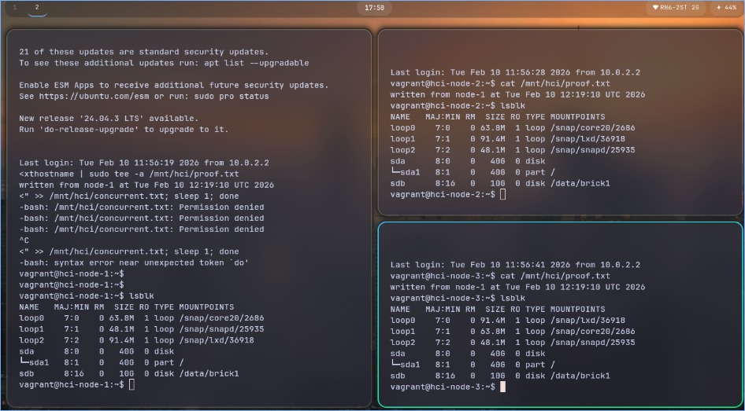

# Mini Hyperconverged Infrastructure (HCI) Lab with GlusterFS

A **3-node Hyperconverged Infrastructure (HCI) simulation** built using **Vagrant**, **VirtualBox**, and **GlusterFS**.
This project demonstrates how **compute, storage, and networking** can be converged on the same nodes using open-source tools.

---

## 📌 Project Overview

Traditional data centers separate compute, storage, and networking into different systems.
**Hyperconverged Infrastructure (HCI)** combines all three into the same nodes, simplifying management and improving scalability.

This lab simulates a **real HCI cluster** locally using virtual machines and a distributed filesystem.

---

## 🧱 Architecture


### Nodes

| Node   | Hostname   | IP Address    |
| ------ | ---------- | ------------- |
| Node 1 | hci-node-1 | 192.168.56.11 |
| Node 2 | hci-node-2 | 192.168.56.12 |
| Node 3 | hci-node-3 | 192.168.56.13 |

### Resources (per node)

* OS: Ubuntu 22.04 LTS
* CPU: 2 vCPU
* RAM: 2 GB
* Storage:

  * OS Disk: 40 GB
  * Data Disk: 10 GB (`/data/brick1`)
* Network: Private host-only network (`192.168.56.0/24`)

---

## 🔗 Networking

* All nodes communicate over a **private network**
* Enables secure node-to-node communication
* Required for distributed storage and cluster services

---

## 💾 Storage Layer (GlusterFS)

* **GlusterFS** is used as the software-defined storage layer
* Each node contributes a storage brick:

  ```
  /data/brick1
  ```
* These bricks form a single logical storage pool


### Gluster Volume

* Volume name: `hci-vol`
* Mounted on all nodes at:

  ```
  /mnt/hci
  ```

---

## 🧪 Proof of HCI & GlusterFS Functionality

### 1️⃣ Cluster Health Verification

```bash
sudo gluster peer status
sudo gluster volume status hci-vol
```

✔ All peers connected
✔ All bricks online

---

### 2️⃣ Shared Storage Test (Cross-node I/O)


**Write on hci-node-1**

```bash
echo "written from node-1 at $(date)" | sudo tee /mnt/hci/proof.txt
```

**Read on hci-node-2**

```bash
cat /mnt/hci/proof.txt
```

**Read on hci-node-3**

```bash
cat /mnt/hci/proof.txt
```

✔ Same file visible on all nodes
✔ Confirms single shared storage pool

---

### 3️⃣ Compute + Storage Convergence

Each node:

* Runs a VM (compute)
* Hosts a Gluster brick (storage)
* Uses the same network fabric

✔ This satisfies the **core definition of HCI**

---

### 4️⃣ Persistent Mount Verification

GlusterFS is configured in `/etc/fstab`:

```text
hci-node-1:/hci-vol  /mnt/hci  glusterfs  defaults,_netdev  0  0
```

Mount verification:

```bash
findmnt | grep hci
```

✔ Ensures storage survives reboots
✔ Production-style configuration

---

### 5️⃣ Disk Layout Validation

```bash
lsblk
```

Shows:

* OS disk (`sda`)
* Dedicated data disk (`sdb`) used for Gluster brick

✔ Clear separation of system and data storage



---

## 🧠 Why This Is Hyperconverged

| HCI Pillar      | How It’s Implemented         |
| --------------- | ---------------------------- |
| Compute         | Ubuntu VMs                   |
| Storage         | GlusterFS distributed volume |
| Networking      | Private host-only network    |
| Scalability     | Add node + brick             |
| Fault tolerance | Distributed storage          |

---

## 📂 Repository Structure

```
.
├── Vagrantfile
├── README.md
└── scripts/
    └── common.sh
```

* `Vagrantfile` – Defines the 3-node cluster
* `common.sh` – Shared provisioning logic
* `README.md` – Documentation and simulation proof

---

## 🚀 How to Run

```bash
git clone https://github.com/karandesai2005/mini-hyperconverged-infra-lab.git
cd mini-hyperconverged-infra-lab
vagrant up
```

SSH into a node:

```bash
vagrant ssh hci-node-1
```

---

## 📈 Future Enhancements

* Replicated or dispersed Gluster volumes
* Kubernetes or Docker workloads
* Monitoring with Prometheus & Grafana
* Node failure and self-healing demonstrations
* Hybrid cloud connectivity (VPN)

---

## 🎯 Conclusion

This project successfully demonstrates a **working Hyperconverged Infrastructure** using:

* Commodity virtual machines
* Software-defined storage
* Shared networking
* Open-source tooling

It closely mirrors real-world HCI platforms such as **VMware vSAN**, **Nutanix**, and **Ceph-based clusters**, making it ideal for academic, demo, and learning purposes.

---

## 📜 License

MIT License
